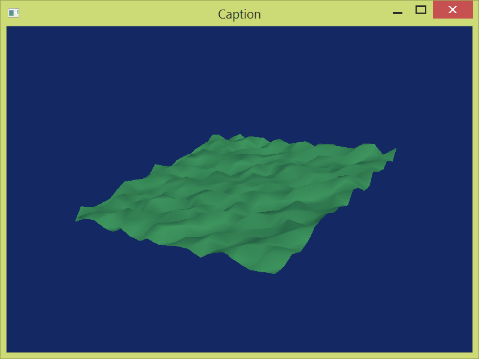

## Démo DirectX

Ceci est une simple démo attestant mes aptitudes en C++, dans un environnement quelconque (Windows dans ce cas-ci) ainsi que l'emploi d'API (DirectX dans ce cas).

Voici une capture d'écran:

#### Élaboration :
Le programme crée une fenêtre, initialise DirectX, génère un terrain, et permet de le visualiser de n'importe quel angle, en le pivotant autour de l'origine à l'aide de la souris.

Le programme fait usage de la programmation orientée objet, d’événements, d'états ainsi que de dispositifs d'interaction, tel souris et clavier.

Tous les événements de base d'une fenêtre sont gérés (maximisation, minimisation, redimensionnement) pour bien afficher le contenu. Avant de quitter l'application, l'usagé est prié de confirmer ce choix.

Certains fichiers, tel librairies auxiliaires, ne sont pas présents. Le répertoire immédiat du projet seulement a été versé, et même là, pour encourager le travail honnête d'éventuels étudiants qui consulterai ce dépôt, certains fichiers ne sont pas offerts

* Dans la mesure que le temps le permettra, cette démo sera améliorée (code et contenu).

#### Technologies ustilisées:
- Windows (win32)
- DirectX9
- C++

#### Lien vidéo:  https://youtu.be/KDWTYPCKp9A 